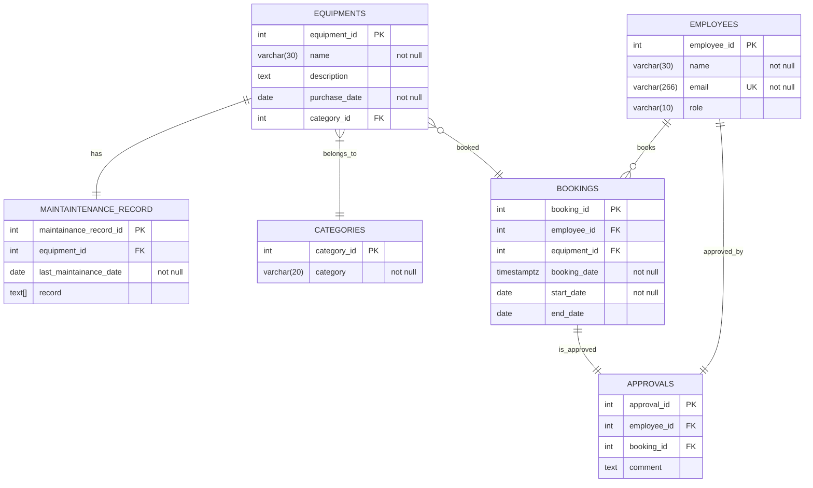

# ER Diagram

```mermaid
erDiagram
    EQUIPMENTS ||--|| MAINTAINTENANCE_RECORD : has
    EQUIPMENTS }|--|| CATEGORIES : belongs_to
    EQUIPMENTS }o --|| BOOKINGS : booked
    BOOKINGS ||--|| APPROVALS : is_approved
    EMPLOYEES ||--o{ BOOKINGS : books
    EMPLOYEES ||--|| APPROVALS : approved_by

    EMPLOYEES {
        int employee_id PK
        varchar(30) name "not null"
        varchar(266) email UK "not null"
        varchar(10) role 
    }
    EQUIPMENTS {
        int equipment_id PK
        varchar(30) name "not null"
        text description
        date purchase_date "not null"
        int category_id FK
    }
    MAINTAINTENANCE_RECORD {
        int maintainance_record_id PK
        int equipment_id FK
        date last_maintainance_date "not null"
        text[] record
    }
    CATEGORIES {
        int category_id PK
        varchar(20) category "not null"
    }
    BOOKINGS {
        int booking_id PK
        int employee_id FK
        int equipment_id FK
        timestamptz booking_date "not null"
        date start_date "not null"
        date end_date
    }
    APPROVALS {
        int approval_id PK
        int employee_id FK
        int booking_id FK
        text comment
    }
```