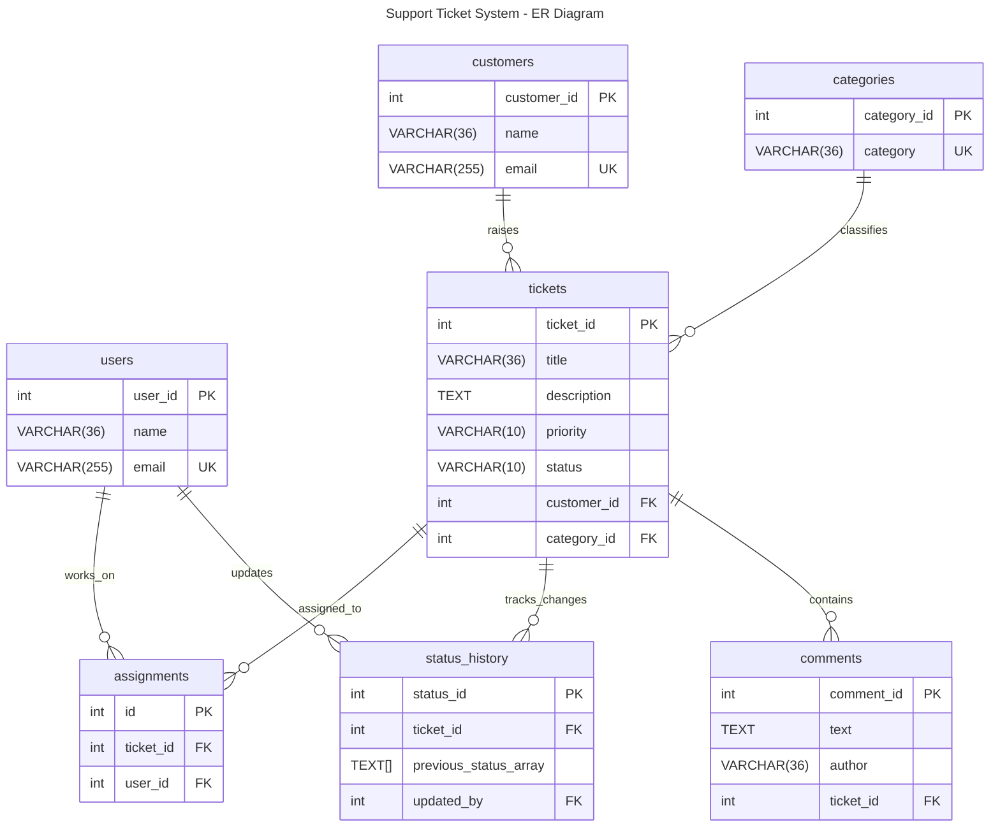

```mermaid
---
title: "Support Ticket System - ER Diagram"
---
erDiagram
    users{
        int user_id PK
        VARCHAR(36) name
        VARCHAR(255) email UK
    }

    customers{
        int customer_id PK
        VARCHAR(36) name
        VARCHAR(255) email UK
    }

    categories{
        int category_id PK
        VARCHAR(36) category UK
    }

    comments{
        int comment_id PK
        TEXT text
        VARCHAR(36) author
        int ticket_id FK
    }

    assignments{
        int id PK
        int ticket_id FK
        int user_id FK
    }

    status_history{
        int status_id PK
        int ticket_id FK
        TEXT[] previous_status_array
        int updated_by FK
    }

    tickets{
        int ticket_id PK
        VARCHAR(36) title
        TEXT description
        VARCHAR(10) priority
        VARCHAR(10) status
        int customer_id FK
        int category_id FK
    }

    customers||--o{ tickets: "raises"
    categories||--o{ tickets: "classifies"
    tickets||--o{ assignments: "assigned_to"
    users||--o{ assignments: "works_on"
    tickets||--o{ status_history: "tracks_changes"
    users||--o{status_history: "updates"
    tickets||--o{ comments: "contains"
```